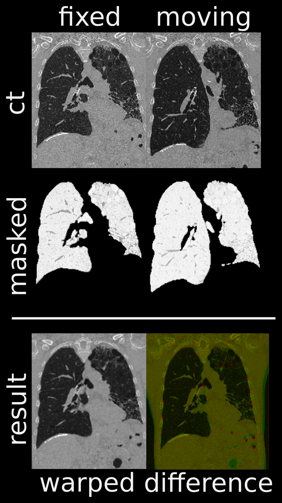

Python implementation based on the work of [Tustison et al.] This script uses [ANTs]. The Example data is lifted from the [registration example] of Tustison.

Example:
========

```bash
./ct_lung_registration.py -f sample_data/N25E_resampled.nii.gz \
                          -m sample_data/N25I_resampled.nii.gz
```
runtime: 14.5 minutes




Requirements
============
  - Python (2 or 3)
  - [ANTs] (testetd with 2.3.1)
  - nibabel
  - scipy
  - skimage


[Tustison et al.]: http://empire10.isi.uu.nl/pdf/article_antsregistrationgaussiansyn.pdf
[ANTs]: https://github.com/ANTsX/ANTs
[registration example]: https://github.com/ntustison/antsCtLungRegistrationExample